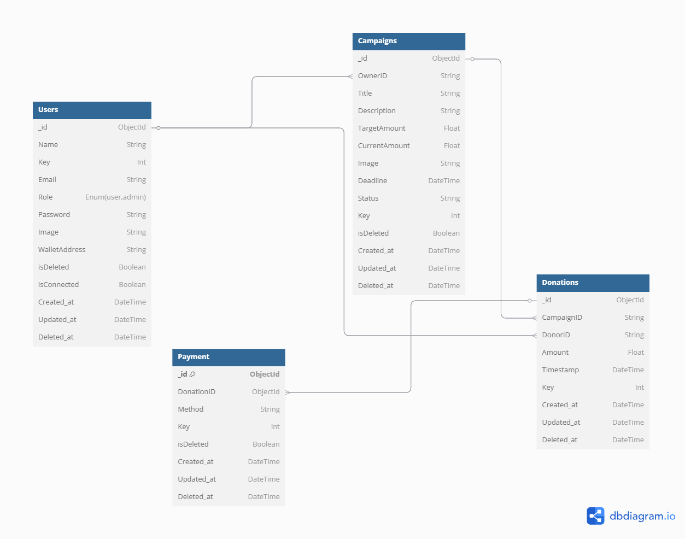

# web3-fullstack-crowdfunding
Documentation Crowdfunding Web3 Fullstack Application


 

A full-stack crowdfunding platform built with **React**, **TypeScript**, **Express**, **MongoDB**, and **Smart Contract** integration. This platform allows users to create campaigns, donate to them, and track contributions securely and transparently using blockchain technology.


## Table of Contents

- [Overview](#overview)
- [Features](#features)
- [Technologies Used](#technologies-used)
- [Getting Started](#getting-started)
  - [Prerequisites](#prerequisites)
  - [Installation](#installation)
  - [Running the Project](#running-the-project)
- [Backend API Documentation](#backend-api-documentation)
- [Frontend Usage](#frontend-usage)
- [Smart Contract Setup](#smart-contract-setup)
- [Testing](#testing)
- [Contributing](#contributing)
- [License](#license)

## Overview

The Crowdfunding Platform allows users to create campaigns, make donations, and track the progress of funding. It also uses a smart contract to ensure transparency and security for all transactions made on the platform. The backend is built with **Express.js** and **MongoDB**, while the frontend uses **React** with **TypeScript**. Blockchain technology is leveraged through smart contracts to process donations securely.

## Features

- **Campaign Creation**: Users can create new crowdfunding campaigns with detailed descriptions, funding goals, and time limits.
- **Donation System**: Users can make donations to campaigns using various payment methods.
- **Progress Tracking**: Donors and creators can track the progress of the campaign.
- **Smart Contract Integration**: All donations are processed through a secure smart contract, ensuring transparency.
- **User Authentication**: Secure user authentication with JWT tokens.
- **Responsive UI**: The front-end is responsive and accessible on both mobile and desktop devices.

## Technologies Used

- **Frontend**:
  - React.js
  - TypeScript
  - Tailwindcss
  - Axios/Node-Fetch (for API calls)
  
- **Backend**:
  - Express.js (Node.js framework)
  - TypeScript
  - MongoDB (for data storage)
  - JWT (for authentication)
  
- **Smart Contract**:
  - Solidity (for Ethereum smart contracts)
  - Web3.js (for interacting with the blockchain)
  
- **Development Tools**:
  - Docker (for containerization)
  - Git & GitHub (version control)
  - Jest (for testing)

## Getting Started

To get started with this project, you will need to follow these steps:

### Prerequisites

Before running the project locally, make sure you have the following installed:

- Node.js (version >=14.0)
- MongoDB (MongoDB Atlas account)
- Solidity (for smart contract deployment)
- MetaMask (for Ethereum interactions)
- Hardhat (for deploying smart contracts)

### Installation

1. **Clone the repository**:

   ```bash
   git clone https://github.com/harystbd05/crowdfunding-platform.git
   cd crowdfunding-platform
   ```

2. **Install backend dependencies**:

   ```bash
   cd be-crowdfunding
   npm install
   ```

3. **Install frontend dependencies**:

   ```bash
   cd fe-crowdfunding
   npm install
   ```

### Running the Project

1. **Set Up Environment Variables**: 
   - Create a `.env` file in the root of your project and add the following variables:
     ```
JWT_SECRET={JWT_SECRET}
DATABASE_URL=mongodb://localhost:27017
DATABASE_NAME={DATABASE_NAME}
PRIVATE_KEY={PRIVATE_KEY}
CONTRACT_ADDRESS={CONTRACT_ADDRESS}
INFURA_KEY={INFURA_KEY}

     ```

2. **Start the backend server**:
   ```bash
   cd backend
   npm run dev
   ```

3. **Start the frontend server**:
   ```bash
   cd frontend
   npm start
   ```

4. **Access the app**:
   - Frontend will be available at [http://localhost:3000](http://localhost:3000).
   - Backend will be available at [http://localhost:5000](http://localhost:5000).

## Backend API Documentation

The backend provides several API endpoints to interact with the crowdfunding platform. Here are some key routes:


Run Deploy smart contract : npx hardhat deploy --network polygon

After that, move the deployed ABI to ./src/ABI.ts


### 1. /api/v1/users
### **POST  {{ _.API_URL }}/api/v1/users**
   Create crowdfunding users.

   Request Body:
   ```json
     {
  	"Name" : "string",
    "Username": "string",
    "Password": "string",
    "Email": "string"
    }
   ```

   Response:
   ```json
   {
	"success": true,
	"message": "User created successfully"
   }  
   ```

### **GET {{ _.API_URL }}/api/v1/users**
   Get all active users.

   Response:
   ```json
   {
	"status": 200,
	"message": "User fetched successfully",
	"data": [
		{
			"_id": "string",
			"username": "string",
			"email": "string",
			"key": 1,
			"password": "string",
			"roles": [
				"string"
			],
			"isDeleted": false,
			"deleted_at": null,
			"created_at": "Date",
			"updated_at": "Date",
			"__v": 0
		},
	]
}
   ```

### **PUT {{ _.API_URL }}/api/v1/users/:id**
   Update crowdfunding users.

   Request Body:
   ```json
    {
      "Username": "string",
      "Password": "string",
      "Email": "string"
    }  
   ```

   Response:
   ```json
   {
  	"success": true,
  	"message": "Update user succesfully"
  }
   ```

### **DELETE {{ _.API_URL }}/api/v1/users/:id**
   Delete crowdfunding users.

   Request Params:
   ```data
  /api/v1/users/:id
   ```

   Response:
   ```json
   {
  	"success": true,
  	"message": "Delete user succesfully"
  }
   ```

### **POST  {{ _.API_URL }}/api/v1/users/login**
   Login crowdfunding users.

   Request Body:
   ```json
     {
   "Email": "string"
    "Password": "string",
    }
   ```

   Response:
   ```json
  {
	"success": true,
	"message": "Login successful",
	"data": {
		"user": "JWT TOKEN"
	}
} 
   ```

### **POST  {{ _.API_URL }}/api/v1/users/connect-wallet**
   Connect crowdfunding users.

   Request Body:
   ```json
     {
  "WalletAddress": "string",
  "Name": "string",
  "Email": "string"
}


   ```

   Response:
   ```json
  {
	"success": true,
	"message": "User connect wallet successfully",
	"data": {
		"_id": "string",
		"Name": "string",
		"Key": 1,
		"Email": "string",
		"Role": "string",
		"Password": "string",
		"WalletAddress": "string",
		"isDeleted": false,
		"Created_at": "Date",
		"Updated_at": "Date",
		"__v": 0,
		"isConnected": true
	}
}
   ```


### **POST  {{ _.API_URL }}/api/v1/users/disconnect-wallet**
   Disconnect crowdfunding users.

   Request Body:
   ```json
     {
  "WalletAddress": "string"
}

   ```

   Response:
   ```json
  {
	"success": true,
	"message": "User disconnect wallet successfully",
	"data": {
		"_id": "string",
		"Name": "string",
		"Key": 1,
		"Email": "string",
		"Role": "string",
		"Password": "string",
		"WalletAddress": "string",
		"isDeleted": false,
		"Created_at": "Date",
		"Updated_at": "Date",
		"__v": 0,
		"isConnected": false
	}
}
   ```

### 2. /api/v1/campaigns
### **POST  {{ _.API_URL }}/api/v1/campaigns**
   Create crowdfunding campaign.

   ```multipart-formData

 Content-Type: multipart/form-data; boundary=--boundary123

--boundary123
Content-Disposition: form-data; name="Title"
Content-Type: text/plain

Description
--boundary123
Content-Disposition: form-data; name="Description"
Content-Type: text/plain

Target Amount
--boundary123
Content-Disposition: form-data; name="TargetAmount"
Content-Type: text/plain

Deadline
--boundary123
Content-Disposition: form-data; name="Deadline"
Content-Type: text/plain

Status
--boundary123
Content-Disposition: form-data; name="Status"
Content-Type: text/plain

OwnerID
--boundary123
Content-Disposition: form-data; name="OwnerID"
Content-Type: text/plain

Image
--boundary123
Content-Disposition: form-data; name="Image"; filename="campaign_image.jpg"
Content-Type: image/jpeg

(binary data of the image)
```

   Response:
   ```json
   {
	"success": true,
	"message": "Campaign created successfully",
	"data": campaignID(number)
}
   ```

### **GET {{ _.API_URL }}/api/v1/campaigns?limit=8&sort=-Created_at&page=1**
   Get all active campaigns.

   Response:
   ```json
   {
	"success": true,
	"message": "Campaign get successfully",
	"data": {
		"campaigns": [
			{
				"_id": "string",
				"Title": "string",
				"Description": "string",
				"TargetAmount": 10,
				"CurrentAmount": 0,
				"Image": "/path/image",
				"Deadline": "Date",
				"Status": "string",
				"Created_at": "Date"
			}
		],
		"total": 16
	}
}   
```

### **PUT {{ _.API_URL }}/api/v1/campaigns/:id**
   Update crowdfunding campaign.

   Request Body:
   ```json
   {
  "OwnerID": 1,
  "Title": "string",
  "Description": "string",
  "TargetAmount": 2.00,
  "CurrentAmount": 100,
  "Deadline": "Date",
  "Status": "String"
}
   ```

   Response:
   ```json
   {
	"success": true,
	"message": "Update Campaign succesfully"
}
   ```

### **DELETE {{ _.API_URL }}/api/v1/campaigns/:id**
   Delete crowdfunding campaign.

   Request Params:
   ```data
  /api/v1/campaigns/:id
   ```

   Response:
   ```json
   {
  	"success": true,
  	"message": "Delete Campaign succesfully"
  }
   ```


### **GET {{ _.API_URL }}/api/v1/campaigns/:id**
   GET crowdfunding campaign by ID.

   Request Params:
   ```data
  /api/v1/campaigns/:id
   ```

   Response:
   ```json
   {
  	"success": true,
  	"message": "Delete Campaign succesfully"
  }
   ```

### 3. /api/v1/donations
### **POST  {{ _.API_URL }}/api/v1/donations**
   Create crowdfunding donations.

   Request Body:
   ```json
     {
  "CampaignID": 1, 
  "DonorID": 1,
  "Amount": "1"
     }
   ```

   Response:
   ```json
   {
	"success": true,
	"message": "Donations created successfully"
   }  
   ```


### **POST  {{ _.API_URL }}/api/v1/donations/withdraw**
   Create crowdfunding donations.

   Request Body:
   ```json
   {
  "CampaignID": 2
    }
   ```

   Response:
   ```json
  {
	"success": true,
	"message": "Successfully withdrawal ",
	"data": "string"
}
```

### 4. /api/v1/profile
### **PUT  {{ _.API_URL }}/api/v1/profile**
   Update crowdfunding profile.

   ```multipart-formData
    Image
--boundary123
Content-Disposition: form-data; name="Image"; filename="campaign_image.jpg"
Content-Type: image/jpeg

(binary data of the image)
   ```

   Response:
   ```json
{
	"success": true,
	"message": "Profile updated successfully",
	"data": {
		"_id": "String",
		"Name": "String",
		"Key": 13,
		"Email": "String",
		"Role": "String",
		"Password": "String",
		"WalletAddress": null,
		"isDeleted": false,
		"isConnected": false,
		"Created_at": "Date",
		"Updated_at": "Date",
		"__v": 0,
		"Image": "/uploads/image.jpg"
	}
}
   ```

### **GET {{ _.API_URL }}/api/v1/profile**
   Get all active profile.

   Response:
   ```json
{
	"success": true,
	"message": "Profile retrieved successfully",
	"data": {
		"_id": "String",
		"Name": "String",
		"Key": 14,
		"Email": "String",
		"Role": "String",
		"Password": "String",
		"WalletAddress": "String",
		"isDeleted": false,
		"isConnected": true,
		"Created_at": "Date",
		"Updated_at": "Date",
		"__v": 0,
		"Image": "/uploads/image.png"
	}
}
   ```

### **DELETE {{ _.API_URL }}/api/v1/profile/:id**
   Delete crowdfunding profile.

   Request Params:
   ```data
  /api/v1/profile/:id
   ```

   Response:
   ```json
   {
  	"success": true,
  	"message": "Delete Profile succesfully"
  }
   ```


## 5. /api/v1/Payments
### **POST  {{ _.API_URL }}/api/v1/payments**
   Create crowdfunding payments.

   Request Body:
   ```json
     {
  "DonationID": 3,
  "Method": "POL"
}

   ```

   Response:
   ```json
   {
	"success": true,
	"message": "Payment created successfully"
   }  
   ```

### **GET {{ _.API_URL }}/api/v1/payments**
   Get all active Payments.

   Response:
   ```json
   {
	"status": 200,
	"message": "Payment fetched successfully",
	"data": [
		{
			"_id": "string",
			"DonationID": 1,
			"Method": "string",
			"key": 1,
			"isDeleted": false,
			"Deleted_at": null,
			"Created_at": "Date",
			"Updated_at": "Date",
			"__v": 0
		},
	]
}
   ```

### **PUT {{ _.API_URL }}/api/v1/payments/:id**
   Update crowdfunding Payments.

   Request Body:
   ```json
    {
     "DonationID": 1,
     "Method": "string",
    }  
   ```

   Response:
   ```json
   {
  	"success": true,
  	"message": "Update Payment succesfully"
  }
   ```

### **DELETE {{ _.API_URL }}/api/v1/payments/:id**
   Delete crowdfunding Payments.

   Request Params:
   ```data
  /api/v1/payments/:id
   ```

   Response:
   ```json
   {
  	"success": true,
  	"message": "Delete Payment succesfully"
  }
   ```


## Frontend Usage

- **Home Page**: Displays a list of active campaigns and allows users to browse through them.
- **Campaign Detail Page**: Provides detailed information about a campaign, including the donation button.
- **Dashboard**: For authenticated users to track their donations and campaign progress.

## Smart Contract Setup

The smart contract is deployed on an Ethereum test network. To interact with the smart contract in the frontend:

1. Install **MetaMask** and configure it with a test network (e.g., Ethereum).
3. Ensure that Web3.js is configured to interact with the correct Ethereum network.
4. The smart contract functions (e.g., `createCampaign`, `donate`) can be called via the Web3.js API.

## Testing

- To run the backend tests:
   ```bash
   cd be-crowdfunding
   npm run test
   ```

- To run frontend tests:
   ```bash
   cd fe-crowdfunding
   npm test
   ```

- To test smart contracts, you can use Truffle or Hardhat to run tests:
   ```bash
   npx hardhat test
   ```

## Contributing

We welcome contributions to improve the Crowdfunding Platform. If you would like to contribute, please follow these steps:

1. Fork this repository.
2. Create a new branch for your feature or bugfix.
3. Write clear, concise commit messages.
4. Push your branch to your forked repository.
5. Open a pull request for review.

Please make sure to follow the code of conduct and style guide when contributing.

## License

This project is licensed under the MIT License - see the [LICENSE](LICENSE) file for details.
